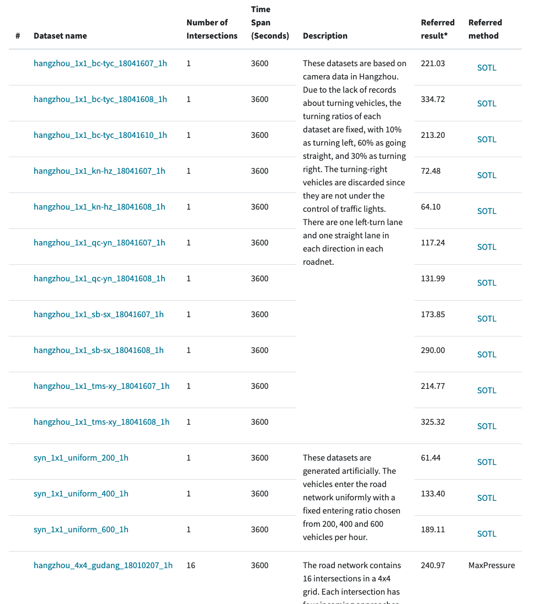

# Reinforcement Learning for Traffic Signal Control

The aim of this repository is to offering comprehensive **dataset**, **simulator**, relevant **papers** and **survey** to anyone who may wish to start investigation or evaluate a new algorithm.

## Table of contents

- [Key paper list](#key-paper-list)
- [Open Datasets](#open-datasets)
- [Traffic Simulator](#traffic-simulator)
- [A comprehensive survey](#survey)

## Key paper list

<!--### Single intersection

| Method | Paper          | Published | Notes   |
| :------------- | :------------- | :-------- | :-----: |
| MetaLight |  [MetaLight: Value-based Meta-reinforcement Learning for Online Universal Traffic Signal Control]() |AAAI'2020 | |
|DemoLight|[Learning Traffic Signal Control from Demonstrations]() |CIKM'19 | |
| FRAP  | [Learning Phase Competition for Traffic Signal Control]() | CIKM'19 |  |
| IntelliLight|[IntelliLight: A Reinforcement Learning Approach for Intelligent Traffic Light Control]() | KDD'18|First try on RL signal control. The base of all the methods|

### Multi-intersection-->

| Method | Paper          | Published | Notes   | Code | Demo video | Poster|
| :------------- | :------------- | :-------- | :-----: | :-----: | :-----: | :-----: | 
| MPLight | [Toward A Thousand Lights: Decentralized Deep Reinforcement Learning for Large-Scale Traffic Signal Control](https://traffic-signal-control.github.io/a-thousand-lights.html) | AAAI'2020 | A combination of PressLight and FRAP  | [Link]() |[Demo]() | [poster]()|
|CoLight |[CoLight: Learning Network-level Cooperation for Traffic Signal Control]() | CIKM'19 | Attention-based coordination| [Link]() | | [poster]()|
|PressLight|[PressLight: Learning Max Pressure Control to Coordinate Traffic Signals in Arterial Network]()|KDD'19| Pressure-based coordination| [Link]() |[Demo]() |[poster]()|
| FRAP  | [Learning Phase Competition for Traffic Signal Control]() | CIKM'19 | Our most powerful single intersectiton control model | [Link]() ||[poster](https://github.com/traffic-signal-control/RL_signals/blob/master/posters/cikm2019_frap.pdf)|
| MetaLight |  [MetaLight: Value-based Meta-reinforcement Learning for Online Universal Traffic Signal Control]() |AAAI'2020 | Meta learning for universal traffic signal control | [Link]() ||[poster]()|
|DemoLight|[Learning Traffic Signal Control from Demonstrations]() |CIKM'19 | Learn from expert demonstrations | [Link]() |NA| [poster](https://github.com/traffic-signal-control/RL_signals/blob/master/posters/cikm-demolight.pdf)|
| IntelliLight|[IntelliLight: A Reinforcement Learning Approach for Intelligent Traffic Light Control]() | KDD'18|First try on RL signal control. The base of all the methods| [Link]() | [Demo]()|[poster](https://github.com/traffic-signal-control/RL_signals/blob/master/posters/KDD18-intelliLight.pdf) |
| CityFlow |[CityFlow: A Multi-Agent Reinforcement Learning Environment for Large Scale City Traffic Scenario](https://arxiv.org/abs/1905.05217) | WWW'19 Demo| Simulator | [Link]()| [Demo]() |[poster]()|

## Open datasets

<!--| # | Name       | Referred Result| Refered method  |
| :------------- | :------------- | :-------- | :-----: |
| 1| hangzhou\_1x1\_bc-tyc\_18041607\_1h |	221.03 | SOTL
| 2| hangzhou\_1x1\_bc-tyc\_18041608\_1h |	 334.72 | SOTL|
||.....||-->
<!--3	hangzhou_1x1_bc-tyc_18041610_1h		213.20	SOTL
4	hangzhou_1x1_kn-hz_18041607_1h	1	72.48	SOTL
5	hangzhou_1x1_kn-hz_18041608_1h	1	64.10	SOTL
6	hangzhou_4x4_gudang_18041610_1h	16	240.97	MaxPressure
-->

## Traffic simulator
We built our own simulator, **CityFlow**. 

CityFlow is an opensourced multi-thread traffic simulator, fast and light.

[Project website](https://github.com/cityflow-project/CityFlow)   
[Documentation and quick start](https://cityflow.readthedocs.io/en/latest/) 

<!--| Paper          | Published | Notes   |
| :------------- | :-------- | :-----: |
|[CityFlow: A Multi-Agent Reinforcement Learning Environment for Large Scale City Traffic Scenario](https://arxiv.org/abs/1905.05217) | WWW'19 Demo| Simulator |
-->

 
## Survey

[A Survey on traffic signal control]()

All Relative paper list

## How to contribute

## Team

